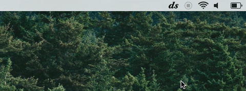

Desaturate
==========

For people who want less visual noise on their screen, Desaturate is a menu bar app to let you easily toggle grayscale display.

Features:

- Toggles grayscale display with CGDisplayForceToGray()
- Global shortcuts when open

Download [here.](https://github.com/seenaburns/Desaturate/releases)
